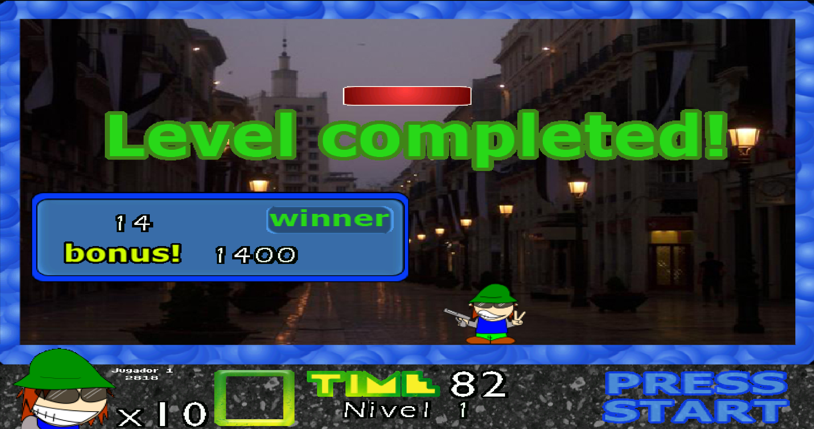
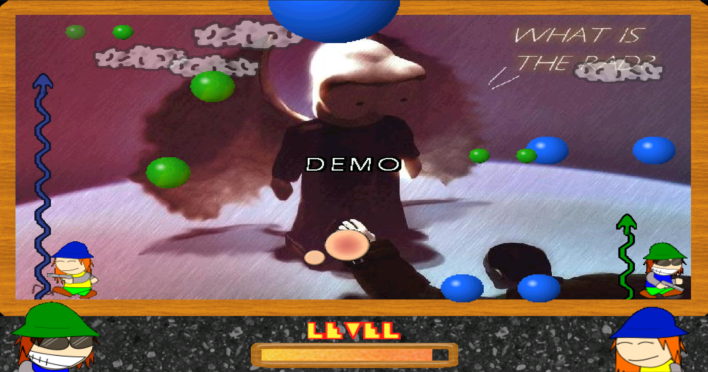

# PiX Pang, recreado en Scratch
Una recreación en Scratch de **PiX Pang**, un juego pang desarrollado por **PiX Juegos**.

Desarrollado para que sea lo más parecido al PiX Pang original.

---

## Enlaces

[Scratch](https://scratch.mit.edu/projects/572038453/) - [Turbowarp](https://turbowarp.org/572038453) 

---

### FAQs

**1. ¿Cómo puedo jugarlo fluidamente?**

> Es recomendable que lo juegues a través de Turbowarp, un fork de Scratch mucho más fluido. Si bien el juego está limitado a 30fps, se puede usar la opción de 'Interpolación' para que se vea más fluido. Tenga en cuenta que, puede llegar a causar glitches visuales, pero no son nada graves.

**2. ¿Cómo puedo jugarlo en una mayor resolución?**

> Esta recreación está hecha para solamente funcionar en 480x360 (res 4:3), usando el programa [Turbowarp Packager](https://packager.turbowarp.org/) puede exportar el proyecto original a una aplicación de Electron con la opción de estirar la resolución.

**3. Encontré un bug, ¿Cómo puedo reportarlo?**

> En el momento que encuentres un bug, presiona la combinación de teclas D + B + G, luego presiona la tecla Y y saca una captura. Crea un nuevo issue, adjunta la captura y describe detalladamente el fallo.
